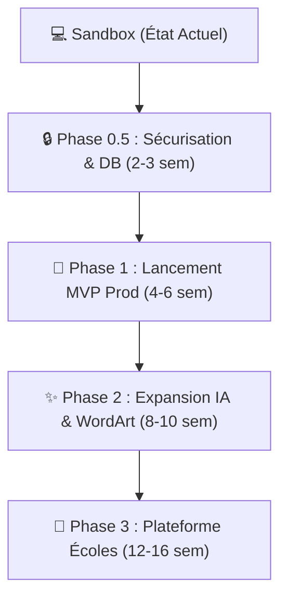
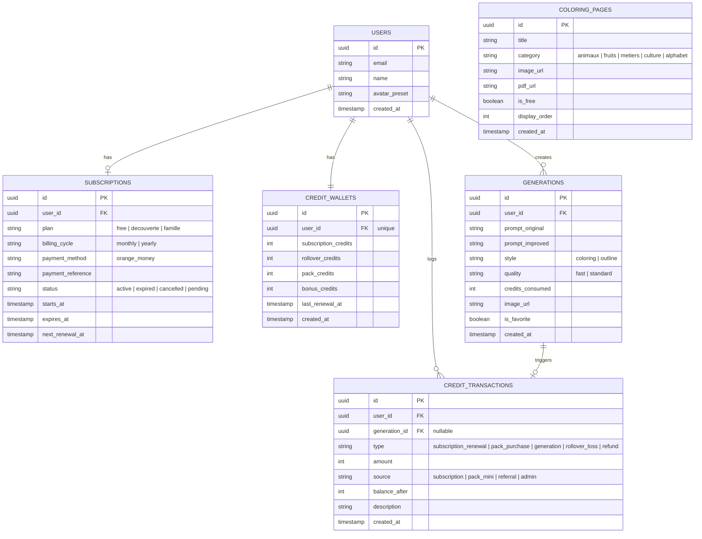

# 🎯 AUDIT STRATÉGIQUE & PLAN D'IMPLÉMENTATION — PETIT BAOBAB STUDIO

## Regard de Product Manager Senior · 20 ans d'expérience
*Document mis à jour pour refléter l'état actuel de la base de code Next.js 15*

---

# PARTIE 1 : DIAGNOSTIC DE L'EXISTANT (MAJU 2026)

## 1.1 Ce qui existe aujourd'hui (État du code & Assets)

Contrairement à l'audit initial, la base de code a considérablement progressé et présente désormais un **prototype fonctionnel avancé (Sandbox)**. Voici l'état exact des livrables :

| Élément | Statut | Qualité / Contenu technique actuel |
| :--- | :--- | :--- |
| **Vision produit** | ✅ Rédigée | Solide — positionnement clair vs ColorBliss (adaptation locale, culturelle et pédagogique). |
| **Plan fonctionnel (16 modules)** | ✅ Rédigé | ⚠️ Riche mais recentré sur les 4 modules du MVP dans le code actuel. |
| **Design System** | ✅ Rédigé & Implémenté | Intégré dans [Design.md](file:///c:/Users/Lenovo/Desktop/Petit%20%20Baobab/Design.md). Nunito Sans, composants Shadcn, thématique enfantine et chaleureuse. |
| **Assets visuels & Mascottes** | ✅ Créés | Mascotte Awa, Bébé Lion, Baobab Robot intégrés sous format PNG/SVG. |
| **Code Source** | ✅ Partiellement Coudé (Prototypage) | Next.js 15 (App Router), TypeScript, Tailwind CSS. Pages Landing, Dashboard, Générateur, Bibliothèque et Paramètres complétées. |
| **Base de données** | 🟡 Schéma défini, mocké en local | Conçu au niveau du schéma SQL. Le code actuel utilise un fallback élégant sur `localStorage` pour simuler le portefeuille et les transactions. |
| **Intégration APIs IA** | 🟡 Code prêt, mocké en local | Routes `/api/generate` prêtes ( OpenAI GPT-4o-mini + Replicate Flux Kontext) avec fallback de démo si les clés API sont absentes. |
| **Paiements (Orange Money)** | 🟡 Portail Sandbox prêt | Route `/api/payments/orange-money` et portail de redirection sandbox codés pour simuler l'achat de packs et d'abonnements. |

> [!IMPORTANT]
> **Verdict actuel** : Nous sommes passés de l'idéation à un **MVP fonctionnel en mode bac à sable (Sandbox)**. La logique métier (crédits FIFO, rollover, filigrane, téléchargements A4) est déjà codée. L'enjeu de la phase actuelle est la **transition vers la production** : connexion Supabase, configuration des clés d'API réelles, et validation du tunnel de paiement marchand Orange Money au Burkina Faso.

---

## 1.2 Analyse du code existant : Forces et Points de vigilance

### 🟢 Les Forces du code actuel
1.  **Architecture État/Transactions robuste** : Le fichier [AppContext.tsx](file:///C:/Users/Lenovo/Desktop/LalaColors/petit-baobab/src/context/AppContext.tsx) implémente une structure transactionnelle claire (`credit_transactions`) pour chaque génération d'image et renouvellement de forfait, ce qui facilitera l'audit financier et préviendra les abus.
2.  **Débit FIFO des crédits opérationnel** : La fonction `executeFifoCreditDebit` consomme d'abord les crédits d'abonnement (les plus éphémères), puis le rollover, puis les bonus et enfin les crédits de pack (permanents). C'est parfait pour la rétention client.
3.  **UI/UX Premium et Cohérente** : Les pages intègrent un design vivant (Nunito, couleurs vives HSL, ombres marquées type Neobrutalisme, mascottes animées), et l'onboarding modale guide parfaitement l'utilisateur.

### ⚠️ Les Points de vigilance pour la mise en production
1.  **Sécurité des transactions** : Les fonctions `confirmPayment` (pour les packs) et `confirmSubscription` (pour les forfaits) sont actuellement déclenchées côté client. Pour éviter la triche (créditer son compte gratuitement), ces fonctions devront être sécurisées via des Webhooks serveurs à la réception de la notification Orange Money.
2.  **Modération des prompts (Safety Filter)** : Bien que `/api/generate` implémente un enrichissement automatique du prompt, il n'y a pas encore de filtre de mots-clés bloquants côté serveur pour empêcher la génération de contenus sensibles ou inappropriés pour les enfants.
3.  **Hébergement et Cold Starts Supabase** : Le plan gratuit de Supabase peut s'endormir après une inactivité prolongée. Il faudra s'assurer que l'authentification et les requêtes initiales gèrent correctement ce délai d'éveil pour éviter les plantages de l'application cliente.

---

# PARTIE 2 : LE PLAN D'IMPLÉMENTATION AJUSTÉ (DU SANDBOX À LA PROD)

Le plan d'implémentation est structuré pour amener le code actuel du mode *Sandbox/Local* à un lancement en *Production* sécurisé, suivi de l'expansion fonctionnelle.

---

## 2.1 Phase 0.5 — Connexion de Production & Sécurisation (2-3 semaines)
**Objectif** : Remplacer les simulateurs de stockage locaux (`localStorage`) par la base de données réelle et sécuriser les transactions financières.

### Actions et Livrables
1.  **Déploiement de la Base de Données Supabase** :
    *   Exécuter les scripts de migration PostgreSQL (création des tables `users`, `credit_wallets`, `credit_transactions`, `generations`, `coloring_pages`).
    *   Configurer les politiques de sécurité **RLS (Row Level Security)** pour que chaque utilisateur n'ait accès qu'à son portefeuille, ses générations et ses transactions.
    *   Créer un seed SQL pour peupler la table `coloring_pages` avec les 50 premiers coloriages gratuits de la bibliothèque (animaux, culture, alphabet).
2.  **Sécurisation du tunnel de paiement** :
    *   Migrer la confirmation de paiement (`confirmPayment` et `confirmSubscription`) de [AppContext.tsx](file:///C:/Users/Lenovo/Desktop/LalaColors/petit-baobab/src/context/AppContext.tsx#L383) vers une route API serveur de Webhook `/api/payments/orange-money/webhook`.
    *   Le Webhook doit vérifier la signature de la requête Orange Money avant de mettre à jour le portefeuille `credit_wallets` en base de données.
3.  **Mise en place des clés API réelles** :
    *   Configurer les variables d'environnement de production (`.env.production`) : `REPLICATE_API_TOKEN`, `OPENAI_API_KEY`, `SUPABASE_SERVICE_ROLE_KEY`, `ORANGE_MONEY_MERCHANT_KEY`.
4.  **Implémentation du Safety Filter** :
    *   Ajouter un middleware de validation dans [api/generate/route.ts](file:///C:/Users/Lenovo/Desktop/LalaColors/petit-baobab/src/app/api/generate/route.ts) qui compare le prompt saisi par l'utilisateur à une liste noire de termes sensibles avant tout appel d'API IA.

---

## 2.2 Phase 1 — Lancement MVP Prod (4-6 semaines)
**Objectif** : Mettre le site en ligne (Vercel) et valider la monétisation auprès des 100 premiers clients payants au Burkina Faso.

### Scope fonctionnel du MVP
*   **Module A (Auth & Dashboard)** : Connexion par email / Google OAuth, profil et choix de la mascotte (Awa, Lion, Robot).
*   **Module B (Générateur Texte → Coloriage)** : Formats A4 Portrait, styles Coloriage et Contour simple, 1 crédit pour génération Rapide, 3 crédits pour génération Améliorée (GPT-4o-mini).
*   **Module C (Bibliothèque Gratuite)** : Exploration par catégories, recherche textuelle, téléchargements A4 illimités à **0 crédit**.
*   **Module D (Export PDF/PNG)** : jsPDF côté client, filigrane "Petit Baobab Studio" actif sur le plan gratuit, retiré pour les abonnés (Découverte et Famille).
*   **Paiement de production** : Intégration Orange Money Burkina Faso opérationnelle.

---

## 2.3 Phase 2 — Expansion IA & WordArt (8-10 semaines)
**Objectif** : Introduire de nouvelles méthodes de génération de coloriage adaptées à l'apprentissage et au cadre familial.

### Nouvelles fonctionnalités
1.  **Module Word Art (Lettres & Mots)** :
    *   L'utilisateur saisit un mot ou le prénom de son enfant.
    *   Génération de lettres bulles ou stylisées à colorier (ex : "A comme ANANAS", motifs traditionnels insérés dans les lettres).
    *   *Coût estimé* : **4 crédits** par génération.
2.  **Module Photo → Coloriage** :
    *   Upload d'une photo de l'enfant ou d'un objet familier.
    *   Modèle IA (Image-to-Image) pour extraire les contours et dessiner en lignes épaisses (adapté au coloriage physique).
    *   *Coût estimé* : **2 crédits** (basique) à **5 crédits** (visages haute fidélité).
3.  **Module Dessin → Coloriage propre** :
    *   Prise de photo d'un gribouillage ou dessin sur papier.
    *   L'IA redessine proprement les contours sous format vectoriel noir et blanc.
    *   *Coût estimé* : **4 crédits**.

---

## 2.4 Phase 3 — Plateforme Éducative & Écoles (12-16 semaines)
**Objectif** : Conquérir les établissements scolaires (maternelles, crèches) et déployer des fonctionnalités de volume.

### Fonctionnalités Écoles & Éducation
1.  **Génération en Masse (Bulk Generation)** :
    *   Réservé au Plan École (20 000 FCFA/mois).
    *   Permet d'envoyer jusqu'à 50 prompts ou 50 photos dans une file d'attente asynchrone (génération de cahiers d'activités pour toute la classe en un clic).
2.  **Espace Enseignant** :
    *   Gestion de comptes multi-enseignants.
    *   Bibliothèque de classe partagée où les enfants peuvent retrouver et imprimer leurs dessins.
3.  **Histoires Illustrées Multilingues** :
    *   Histoires courtes lues par l'application (synthèse vocale) en Français, Mooré et Dioula.
    *   Génération de planches de coloriage correspondantes à chaque scène de l'histoire pour allier lecture et activité manuelle.

---

# PARTIE 3 : SCHÉMA DE BASE DE DONNÉES SÉCURISÉ

Le schéma implémenté en PostgreSQL sur Supabase intègre les politiques de sécurité (RLS) pour isoler les données sensibles (portefeuilles, transactions) tout en gardant la bibliothèque publique en lecture seule.

---

# PARTIE 4 : RENTABILITÉ & ÉCONOMIE UNITAIRE

Pour garantir la pérennité financière de la plateforme face aux coûts d'API (OpenAI + Replicate), le tarif du crédit est calibré avec une marge brute minimale de **30% à 50%**, en tenant compte du comportement réel des abonnés :

*   **Coût d'API estimé par crédit** : ~15 FCFA.
*   **Utilisation moyenne de l'IA** : 65% (le reste de l'usage se fait sur le contenu statique gratuit de la bibliothèque).

### Simulation Financière par Plan :

| Plan | Prix / mois | Crédits IA inclus | Taux de consommation IA estimé | Coût API réel | **Marge nette ajustée** |
| :--- | :--- | :--- | :--- | :--- | :--- |
| **Découverte** | 1 500 FCFA | 100 cr. | ~45% | ~675 FCFA | **825 FCFA (55%)** ✅ |
| **Famille** | 3 500 FCFA | 300 cr. | ~45% | ~2 025 FCFA | **1 475 FCFA (42%)** ✅ |
| **Mini Pack** | 500 FCFA | 25 cr. | 100% | 375 FCFA | **125 FCFA (25%)** ✅ |

---

# PARTIE 5 : PLAN DE VÉRIFICATION & DE RECETTE

### Tests Automatisés
- **Validation du calcul de crédits** : Écrire un test unitaire sur la logique FIFO (`executeFifoCreditDebit`) pour vérifier que le débit s'effectue dans le bon ordre de priorité de portefeuille.
- **Validation des routes API** : Tester l'API `/api/generate` avec des jetons valides et invalides pour valider le code d'erreur `429` (solde insuffisant).

### Tests Manuels & Métriques en Sandbox
- **Parcours d'achat Orange Money** : Effectuer une simulation d'achat complète sur le portail sandbox Orange Money, vérifier que la redirection vers le dashboard applique bien les crédits et enregistre la transaction dans l'onglet d'audit.
- **Test d'impression physique** : Exporter un fichier PDF depuis un smartphone d'entrée de gamme, vérifier le cadrage A4 sur une imprimante physique locale.
- **Modération** : Tenter d'envoyer un prompt inapproprié et s'assurer que le filtre serveur bloque la génération d'image avant d'interroger Replicate.
