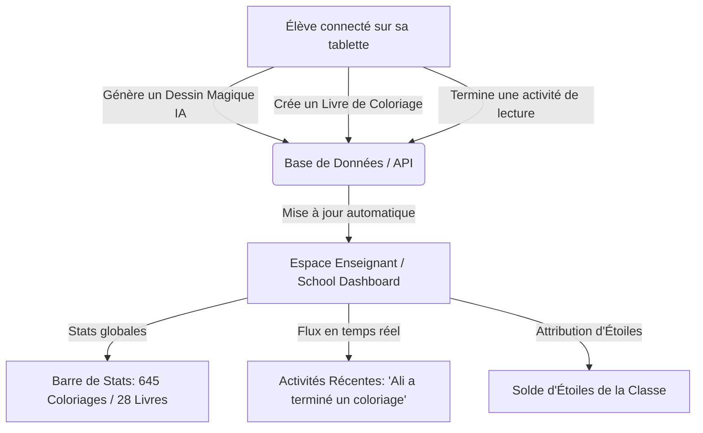

# Analyse Architecturale : Similitudes & Logique Inter-Modules

Ce document présente une analyse transversale de la plateforme **Petit Baobab**, mettant en lumière la cohérence logique et les ponts techniques entre l'**Espace Enfant** (modules *Dessin Magique* et *Livres*) et l'**Espace École** (modules *Dashboard* et *Classes*).

---

## 1. La Logique d'Intégration des Données (Data Flow)

Il existe une relation symbiotique directe entre ce que l'enfant fait sur sa tablette/ordinateur et ce que l'enseignant voit sur son tableau de bord :

### Similitudes Techniques :
- **Action de l'élève** : Chaque action de l'élève (dessin créé, livre généré, login) écrit dans la table `school_students_activities` via les APIs du backend.
- **Réception Dashboard** : Le store [school-store.ts](file:///c:/Users/Lenovo/Desktop/Petit%20%20Baobab/petit-baobab/src/stores/school-store.ts) écoute ou interroge ces activités à intervalles réguliers (polling toutes les 30s) pour alimenter le flux d'activités récentes ([RecentActivities.tsx](file:///c:/Users/Lenovo/Desktop/Petit%20%20Baobab/petit-baobab/src/components/school/RecentActivities.tsx)).

---

## 2. Le Système de Gamification (Les Étoiles)

L'économie des **Étoiles** est le moteur d'engagement de Petit Baobab. Elle fonctionne de manière complémentaire dans les deux espaces :

| Logique | Espace Enfant (`/magic-drawing` & `/livres`) | Espace École (`/school/*`) |
|:---|:---|:---|
| **Rôle** | Consommateur (Dépense) | Distributeur & Superviseur (Recharge) |
| **Mécanisme** | L'enfant dépense des étoiles pour débloquer des styles premium ou générer des PDF complexes. | L'enseignant achète des packages d'étoiles (ex: 740/1000) et les attribue aux classes ou suit le gain collectif. |
| **Feedback visuel** | Badges d'étoiles dans le header enfant. | Widget circulaire de solde et historique des gains récents. |

---

## 3. L'Authentification et la Gestion de Session

La logique de connexion diffère pour s'adapter à la cible (enfants vs adultes), mais partage un modèle de profil centralisé :

- **Côté Enfant (en classe)** : Connexion simplifiée par **Code Classe** (ex: `BAOBAB-CE1`) et sélection du prénom/mascotte de l'enfant (Awa, Kofi, Moussa) sans mot de passe complexe, sécurisée par un JWT léger (`sb-student-token`).
- **Côté Enseignant** : Connexion classique par e-mail et mot de passe (via Supabase Auth) qui lui donne accès à la clé de chiffrement et au code de classe à partager.

### Similitude et Correction requise (vu dans [LIVRE.md](file:///c:/Users/Lenovo/Desktop/Petit%20%20Baobab/LIVRE.md)) :
- L'Espace Enfant a tendance à utiliser des profils d'élèves codés en dur dans certains headers (ex: `"kofi"`, `"awa"`). Pour unifier la logique, ces composants doivent lire `useProfileStore` pour refléter les mêmes élèves configurés par l'enseignant dans l'Espace École.

---

## 4. L'Unification de la Charte Graphique (Design Tokens)

Pour maintenir l'aspect premium et ludique de la plateforme, les deux espaces partagent les mêmes codes esthétiques, même si l'Espace École est plus structuré (orienté "Productivité") et l'Espace Enfant plus immersif (orienté "Jeu").

### Les similitudes de design :
1. **Palette Colorée** :
   - Fond beige chaud chaleureux : `#FFF9F2` ou `#FFFDF8` (au lieu d'un blanc stérile).
   - Couleurs vives et chaleureuses pour les catégories (vert émeraude, jaune ambré, rose fuchsia).
2. **Typographie** : Famille de police ronde et lisible **Nunito Sans** pour un rendu doux et enfantin.
3. **Bordures & Ombres** :
   - Bordures contrastées de couleur chocolat `#3B2416` (2px à 4px) combinées à des angles arrondis généreux (`rounded-2xl` à `rounded-[36px]`).
   - Ombres solides et plates pour donner un aspect "BD/Cartoon" (ex: `shadow-[4px_4px_0px_0px_#3B2416]`).

### Correction de couleur à appliquer (vu dans [LIVRE.md](file:///c:/Users/Lenovo/Desktop/Petit%20%20Baobab/LIVRE.md)) :
- Le module Livres de coloriage utilise encore le violet `#7D6AF8` au lieu de `#6D4CFF` (le violet unifié de l'application). Cette harmonisation est nécessaire pour unifier la charte.

---

## 5. Parallélisme des Widgets d'Actions

Certaines mécaniques d'UI se répètent intelligemment entre les interfaces :
- **Aperçus en temps réel** : La génération de couverture de livre (Espace Enfant) partage la même logique d'aperçu d'images que les cartes de classes (Espace École) avec des illustrations immersives.
- **Barres de progression** : Les barres affichant la progression d'un livre (Enfant) et le pourcentage d'activités terminées (École) partagent les mêmes classes CSS et le même comportement d'animation.
